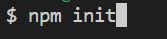

# Team Profile Generator

## Description

- This program will generate a index.html file dynamically based on a series of prompted user inputs.
- The purporse of the generated index.html is to serve as team profile of an office.
- A team can have only one manager and as many employees as the user wishes to add. The user will need to enter an office number for the manager role.
- An employee can either be an engineer or an intern. The user will need to add a Github profile for engineers and need to add a school name for interns.
- A HTML template is also provided for the structure of the generated file.
- CSS styling is also included.

## Table of content

- [Installation](#installation)
- [Usage](#usage)
- [Credits](#credits)
- [License](#license)

## Installation

- If you do not have a package.json file yet in your working directory, create one by doing:

  - 

- Then, install inquirer and jest. Jest is for testing:

  - 
  - 

- After installation, your package.json file should look like this:
  - 

## Usage

- Link to the demo video: [https://app.castify.com/view/8a08248a-ef15-4ab6-a3b9-668be6ab9a46](https://app.castify.com/view/8a08248a-ef15-4ab6-a3b9-668be6ab9a46)

- Link to the Github Repository: [https://github.com/BranBao1995/Team-Profile-Generator](https://github.com/BranBao1995/Team-Profile-Generator)

- To run the program, in the terminal, type "node index.js".

- Enter the manager's info (a team should have at least 1 employee which is the manager).

- After entering the manager's info, and the user selects to add an engineer to the team:

  - 

- When the user decides to not add any more employees, select finish:

  - 

- A new HTML file will be generated inside of the dist folder:

  - 

- The webpage ends up looking like this:
  - 

## Credits

- Author's Github Profile: [https://github.com/BranBao1995?tab=repositories](https://github.com/BranBao1995?tab=repositories)

## License 

The MIT License

Copyright (c) [2022] [Hongdong Bao]

Permission is hereby granted, free of charge, to any person obtaining a copy
of this software and associated documentation files (the "Software"), to deal
in the Software without restriction, including without limitation the rights
to use, copy, modify, merge, publish, distribute, sublicense, and/or sell
copies of the Software, and to permit persons to whom the Software is
furnished to do so, subject to the following conditions:

The above copyright notice and this permission notice shall be included in all
copies or substantial portions of the Software.

THE SOFTWARE IS PROVIDED "AS IS", WITHOUT WARRANTY OF ANY KIND, EXPRESS OR
IMPLIED, INCLUDING BUT NOT LIMITED TO THE WARRANTIES OF MERCHANTABILITY,
FITNESS FOR A PARTICULAR PURPOSE AND NONINFRINGEMENT. IN NO EVENT SHALL THE
AUTHORS OR COPYRIGHT HOLDERS BE LIABLE FOR ANY CLAIM, DAMAGES OR OTHER
LIABILITY, WHETHER IN AN ACTION OF CONTRACT, TORT OR OTHERWISE, ARISING FROM,
OUT OF OR IN CONNECTION WITH THE SOFTWARE OR THE USE OR OTHER DEALINGS IN THE
SOFTWARE.
